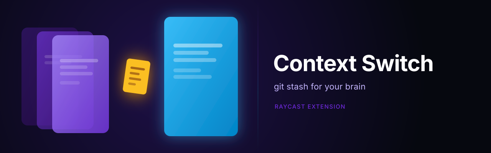

# Context Switch

A Raycast extension that orchestrates context switching with brain stashing — save what's on your mind before switching workspaces, pick it back up when you arrive.

## What it does

1. **Stash** — before leaving a context, optionally dump what you're thinking about
2. **Switch** — delegates the actual desktop/focus switch to a configurable executor
3. **Pop** — when you arrive at the destination, your previous notes are waiting

## Commands

| Command | Description |
|---|---|
| **Switch Context** | Stash + switch. Invokable via Quicklink with a `?arguments={"to":"slug"}` argument. |
| **Pop** | Review and pop stashed notes for the current context. |
| **Settings** | Create Quicklinks for each configured context. |

## Setup

### 1. Create your config file

Default location: `~/.config/context-switch/config.json`

```json
{
  "contexts": [
    { "id": "personal", "label": "Personal", "icon": "🏠" },
    { "id": "work",     "label": "Work",     "icon": "💼" },
    { "id": "study",    "label": "Study",    "icon": "🎓" }
  ],
  "plugins": {
    "reader": {
      "type": "file",
      "path": "~/.config/context-switch/current"
    },
    "switcher": {
      "type": "url",
      "template": "your-switcher-url?context={context}"
    }
  }
}
```

The `{context}` placeholder is replaced with the context slug when switching.

### 2. Configure your switcher

The switcher is whatever handles the actual desktop/focus/window switch on your machine. Any URL scheme or shell command works. See [Plugin configuration](#plugin-configuration) below.

### 3. Create Quicklinks

Open **Context Switch: Settings** in Raycast. Press `↩` on each context to create a Quicklink. Then go to **Raycast Settings → Extensions → Quicklinks** and assign a hotkey to each one.

### 4. (Optional) Set a custom config path

In **Raycast Settings → Extensions → Context Switch**, you can pick a different config file location.

---

## Plugin configuration

### Reader plugins

How the extension reads the current active context.

| Type | Config | Notes |
|---|---|---|
| `file` | `path` | A file your switcher writes the current context slug to. Default: `~/.config/context-switch/current` |
| `shell` | `command` | A shell command whose stdout is the current context slug. |
| `shortcuts` | `shortcutName` | A macOS Shortcut that outputs the current context slug. |

### Switcher plugins

How the extension triggers a context switch.

| Type | Config | Notes |
|---|---|---|
| `url` | `template` | Opens a URL. Use `{context}` as a placeholder for the slug. |
| `shell` | `template` | Runs a shell command. Use `{context}` as a placeholder. |

#### Hammerspoon example

```json
"switcher": {
  "type": "url",
  "template": "hammerspoon://switch-context?to={context}"
}
```

With the companion [hammerspoon-config](https://github.com/pandres95/hammerspoon-config), Hammerspoon handles the Desktop switch, Chrome focus, and Focus Mode — and opens Raycast's Pop command when the switch is complete.

---

## Architecture

```
Raycast (orchestrator)
  └── Switch command
        ├── reads current context   → Reader plugin
        ├── saves stash note        → JsonStorage (~/.config/context-switch/stash.json)
        └── calls switcher          → Switcher plugin

Switcher (executor, e.g. Hammerspoon)
  ├── switches Desktop space
  ├── activates Focus Mode
  ├── focuses Chrome profile
  └── opens Raycast Pop (if notes exist at destination)
```

Plugins are swappable — see `src/plugins/index.ts`.

## License

MIT
